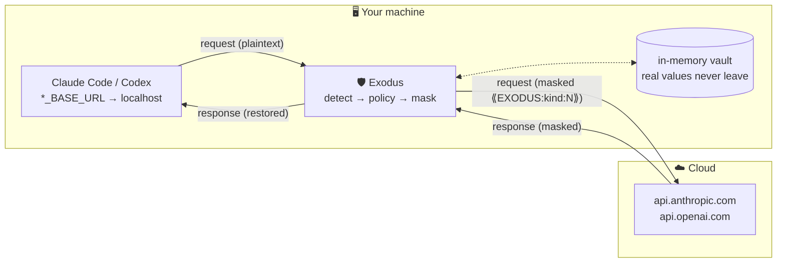

# 🛡️ Exodus — the privacy firewall for AI coding agents

> Claude Code and Codex ship your prompts to the cloud — and sometimes your API keys,
> credit cards and personal data go along for the ride. **Exodus masks them before they
> leave your machine** and restores them in the reply, so your tools never notice.


**🌐 English (primary)** · [Español](esp/README.md)

<p align="center">
  
</p>
<p align="center"><sub>Real session, no edits: the reply comes back intact — but the cloud only ever saw
<code>⟪EXODUS:anthropic_key:1⟫</code>. Reproduce it yourself from <a href="docs/demo/">docs/demo/</a>.</sub></p>

---

## ⚠️ Honest scope (read this first)

Exodus is **harm reduction, not invisibility.** It does not sell an impossible promise.

- The model runs **on the provider's servers**, so your prompt *must* reach them for the
  AI to answer. Exodus does not make your message invisible — it **removes the sensitive
  parts before they travel**.
- It masks what it can **recognize**: secrets with a known signature (`sk-ant-…`, `AKIA…`,
  JWTs…) and structured PII that **validates** (credit cards via Luhn, IBAN via mod-97,
  DNI/NIE, SSN). A random string with no signature is *not* detectable as a secret.
- It does **not** hide your identity/metadata — the provider still knows it's your account.
- The optional local-model layer is **lossy**: it strips identifiers from free text,
  but the general meaning still leaves the machine.
- **GUI consumer apps (Claude Desktop, ChatGPT app) are out of scope** — Exodus protects
  the *agentic / API loop* (CLIs, SDKs), the high-risk surface where an agent autonomously
  ships your code and secrets to the cloud.

Full, formal threat model: [`docs/threat-model.md`](docs/threat-model.md). **Read it before
trusting Exodus with anything.**

---

## How it works



Your client honors a base-URL env var (`ANTHROPIC_BASE_URL`, `OPENAI_BASE_URL`). Point it at
Exodus. Exodus scans each request, replaces detected secrets/PII with reversible placeholders
(`⟪EXODUS:kind:N⟫`), forwards the cleaned request, and restores the originals in the response.
Diagrams: [`docs/ARQUITECTURA.md`](docs/ARQUITECTURA.md).

---

## Install

Requires Python ≥ 3.11.

```bash
git clone <repo-url> exodus && cd exodus
python -m venv .venv && source .venv/bin/activate
pip install -e .                 # core firewall — zero model, zero Ollama
pip install -e ".[local]"        # optional: embedded local model (free-text layer)
```

---

## How to use

### 1 · Start Exodus
```bash
exodus serve                     # listens on http://127.0.0.1:8787
```

### 2a · Claude Code (Anthropic)
In the terminal where you launch Claude Code — **export first, then launch**:
```bash
export ANTHROPIC_BASE_URL=http://127.0.0.1:8787
claude
```
The `WITH EXODUS` status indicator means you're protected.

### 2b · Codex (OpenAI)

> **Mode matters:** Codex has two authentication modes.
> - **OAuth login** (`codex login`) — Codex connects directly to OpenAI with its own tokens; `OPENAI_BASE_URL` is ignored. Exodus cannot intercept this mode (same design limitation as GUI desktop apps).
> - **API key mode** — Codex respects `OPENAI_BASE_URL` and routes through Exodus. Requires a key from [platform.openai.com/api-keys](https://platform.openai.com/api-keys).

To use Exodus with Codex in API key mode:
```bash
# Terminal 1 — start Exodus pointing at OpenAI
EXODUS_UPSTREAM=https://api.openai.com EXODUS_PORT=8788 exodus serve

# Terminal 2 — launch Codex with your platform.openai.com key
export OPENAI_API_KEY=sk-...your-key...
export OPENAI_BASE_URL=http://127.0.0.1:8788/v1
codex
```

### 3 · See what actually left your machine
```bash
exodus audit                     # kinds + actions that were masked — never the values
```
Opt-in debug (full plaintext of **your own** traffic; off by default, git-ignored):
```bash
EXODUS_INSPECT=on exodus serve
```

---

## What it detects

**Secrets** — always masked:
Anthropic · OpenAI (+ `sk-proj-`) · AWS · Google (API + OAuth) · GitHub (token / PAT / OAuth)
· Slack (token + webhook) · Stripe · SendGrid · npm · JWT · PEM private keys · generic Bearer
· DB connection URIs with credentials.

**Structured PII** — validated, masked by default:
credit cards (Luhn) · IBAN (mod-97) · Spanish DNI / NIE · US SSN.

**Lower-sensitivity PII** — detected, opt-in:
email · IPv4 · international phone.

**Free text** (names, addresses, sensitive prose — any language) → the optional local model
below. Regex can't scale to every country and language; the model is the multilingual answer.

You own the policy: edit [`src/exodus/policy/policy.example.yaml`](src/exodus/policy/policy.example.yaml)
to set each kind's action (`forward` / `pseudonymize` / `block`). **Fail-closed** by default —
an unknown kind is treated as a secret.

---

## Proof it works

A built-in self-test runs a **fake** sample of every detector kind through the real
pipeline and verifies three things: the kind is detected, its value never appears in the
outgoing request, and the local vault restores the original bytes exactly.

```bash
exodus selftest
```


Every value is synthetic (documented test tokens, reserved-for-docs identifiers). The same
matrix runs in the test suite, so adding a detector without coverage fails the tests.

---

## Optional local model

For sensitive content with *no signature*, Exodus runs a small model **embedded in-process**
(llama.cpp + a GGUF — **no Ollama daemon**) to classify and abstract it. Off by default; the
core firewall works without it.

```bash
pip install -e ".[local]"
EXODUS_LOCAL_MODEL=on exodus serve   # downloads a small multilingual model once, then offline
```
Backend is pluggable: `EXODUS_LOCAL_BACKEND=embedded` (default) or `ollama`.

Example — the model strips identifiers, keeps the gist:
```
in:  Patient John Smith, 47, record #55231, 12 Oak St, Madrid, has asthma.
out: Patient has asthma.
```

---

## Configuration

Copy `.env.example` → `.env`. Key variables:

| Variable | Purpose |
|---|---|
| `EXODUS_UPSTREAM` | provider API to forward to (Anthropic default; `https://api.openai.com` for Codex) |
| `EXODUS_HOST` / `EXODUS_PORT` | where Exodus listens (default `127.0.0.1:8787`) |
| `EXODUS_POLICY_FILE` | your policy YAML |
| `EXODUS_LOCAL_MODEL` / `EXODUS_LOCAL_BACKEND` | enable + choose the local-model backend |
| `EXODUS_INSPECT` | debug log of your own traffic (full plaintext; off by default) |

---

## Tests
```bash
pip install -e ".[dev]" && pytest        # 73 passing
```

---

## Run it inside a TEE (Gramine / Intel SGX)

The vault can be protected even from the machine's root user by running Exodus inside
an SGX enclave via [Gramine](https://gramineproject.io) — no code changes, one manifest:

```bash
gramine-manifest -Darch_libdir=/lib/x86_64-linux-gnu exodus.manifest.template exodus.manifest
gramine-direct exodus              # simulation, any x86_64 Linux
exodus verify --allow-simulated    # attestation handshake (nonce → report → verdict)
```


On SGX hardware the same manifest runs with `gramine-sgx` and `/_exodus/attest` returns a
hardware quote; `exodus verify --mrenclave <hex>` pins the exact build. Details, honest
scope and limits: [`docs/TEE.md`](docs/TEE.md).

---

## MCP server (agent integration)

Exodus speaks the [Model Context Protocol](https://modelcontextprotocol.io): any MCP
client (Claude Code, Claude Desktop, custom agents) can use the firewall as a set of tools.

```bash
claude mcp add exodus -- exodus mcp     # register with Claude Code
```

| Tool | What it does |
|---|---|
| `exodus_mask` | mask secrets/PII in a text before it travels anywhere |
| `exodus_verify` | attestation handshake against a running proxy — *can this gateway be trusted?* |
| `exodus_audit` | what has been masked so far (kinds and counts, never the values) |

The interesting one is `exodus_verify`: it gives agents a primitive to **check the
privacy gateway before routing secrets through it** — nonce freshness, attestation
binding, TLS channel binding and MRENCLAVE pinning, straight from the agent loop
(see [`docs/TEE.md`](docs/TEE.md)).

---

## Where Exodus fits (honest positioning)

Sensitivity-aware cloud/edge routing is an active research area (PRISM, PrivacyPAD,
Privacy Guard — see [`paper/references.bib`](paper/references.bib)), mostly on *generic*
prompts. **Exodus's contribution is an engineering artifact:** an open-source implementation
that brings these ideas to the **agentic coding loop** (tool-use, file edits, SSE streaming),
with a reversible vault, an honest threat model, and a self-contained local model. See
[`paper/`](paper/).

## Project layout & roadmap
Structure: [`docs/ESTRUCTURA.md`](docs/ESTRUCTURA.md) · Roadmap: [`docs/ROADMAP.md`](docs/ROADMAP.md)
· Contributing: [`CONTRIBUTING.md`](CONTRIBUTING.md)

## License
MIT © Francesco Catania ([@sekaibuilder](https://github.com/sekaibuilder)). See [`LICENSE`](LICENSE).

## Disclaimer
Exodus is a **harm-reduction** tool, not a guarantee of anonymity. It reduces the sensitive
data that reaches third-party servers; it does not make you invisible. Do not feed it secrets
you cannot afford to leak on the assumption that it is infallible.
