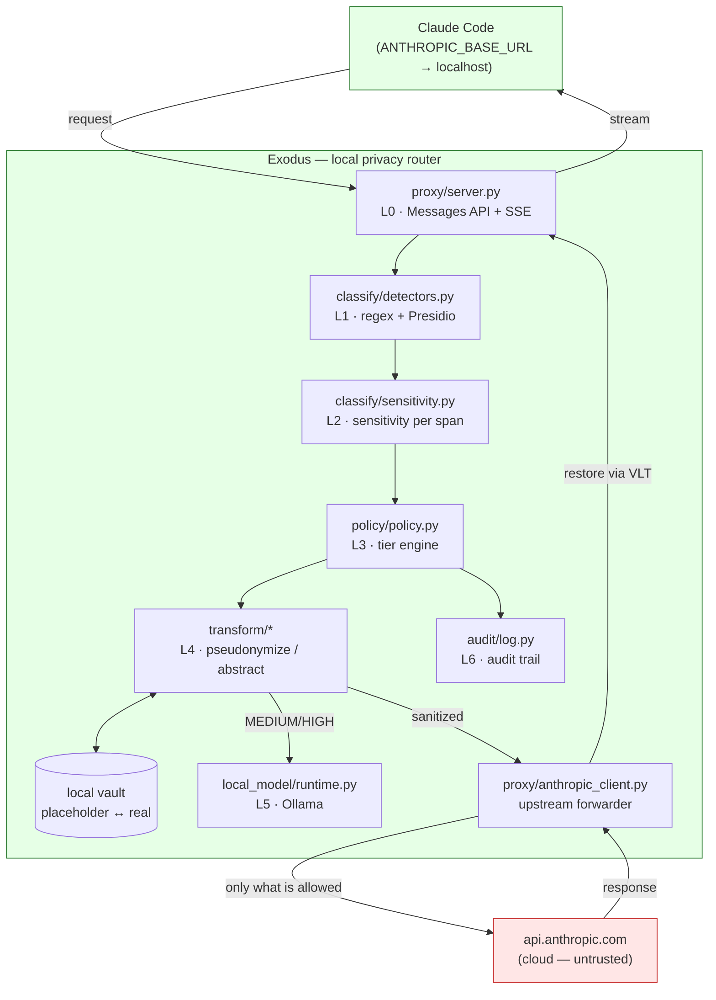
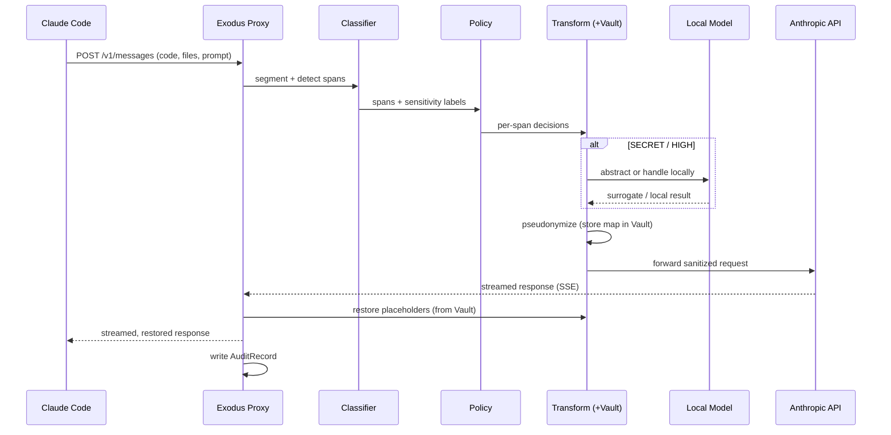
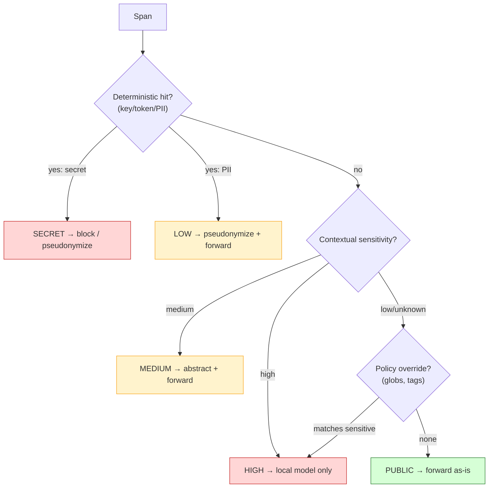
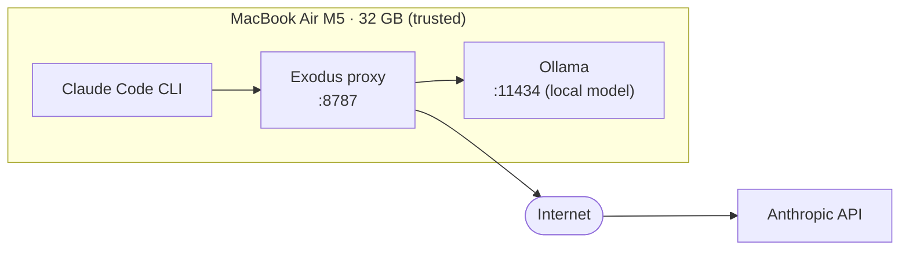

# Exodus — Architecture (graphical)

> Diagrams use [Mermaid](https://mermaid.js.org/), which renders natively on GitHub.
> Keep these in sync with the code; update them on any architectural change.

---

## 1. Component diagram

**Trust boundary:** everything inside the green box runs on the user's machine. The red node is the only thing on the far side of the boundary — and it only ever receives what policy allowed.

---

## 2. Request sequence (happy path)

---

## 3. Routing decision (per span)

> **Fail-closed:** the `unknown` path biases toward the policy/override check rather than defaulting to `PUBLIC`.

---

## 4. Deployment view (MVP, on the user's Mac)

