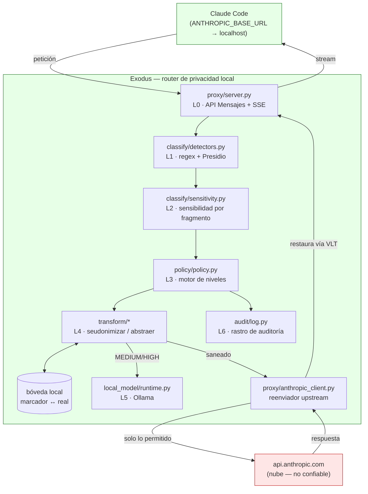
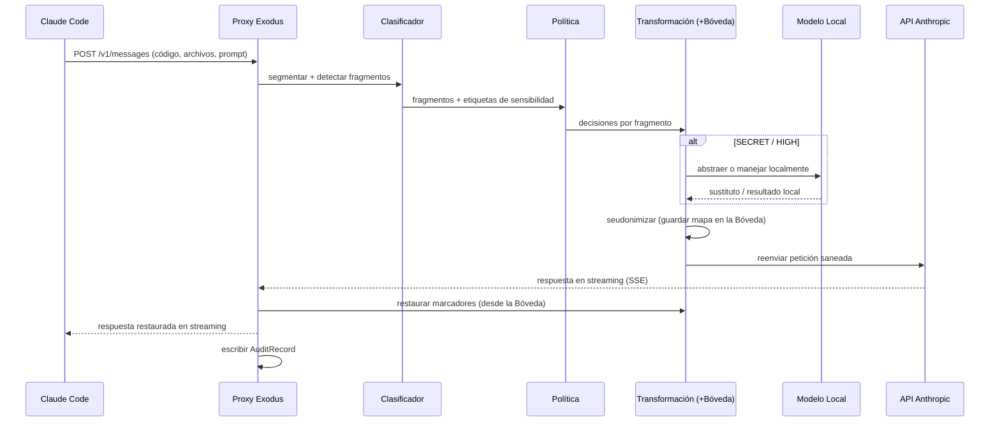
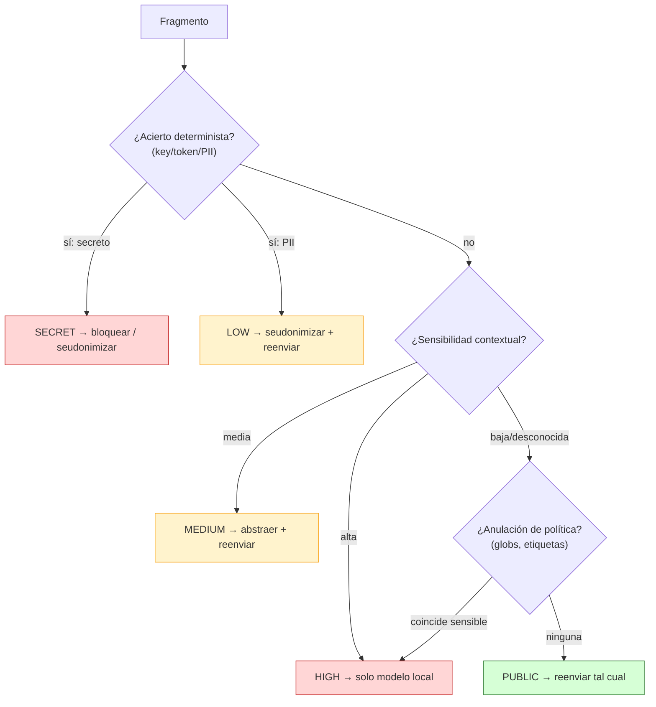
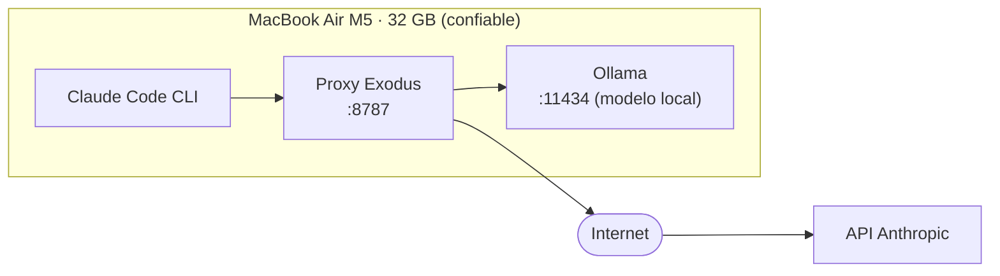

# Exodus — Arquitectura (gráfica)

> **Edición en español** (la versión canónica es [`docs/ARQUITECTURA.md`](../docs/ARQUITECTURA.md)). Los diagramas usan [Mermaid](https://mermaid.js.org/), que se renderiza nativamente en GitHub. Mantenerlos en sync con el código.

---

## 1. Diagrama de componentes

**Frontera de confianza:** todo lo de la caja verde corre en la máquina del usuario. El nodo rojo es lo único al otro lado de la frontera — y solo recibe lo que la política permitió.

---

## 2. Secuencia de petición (camino feliz)

---

## 3. Decisión de enrutado (por fragmento)

> **Fail-closed:** el camino `desconocida` se inclina hacia la comprobación de política/anulación en vez de caer por defecto a `PUBLIC`.

---

## 4. Vista de despliegue (MVP, en el Mac del usuario)

